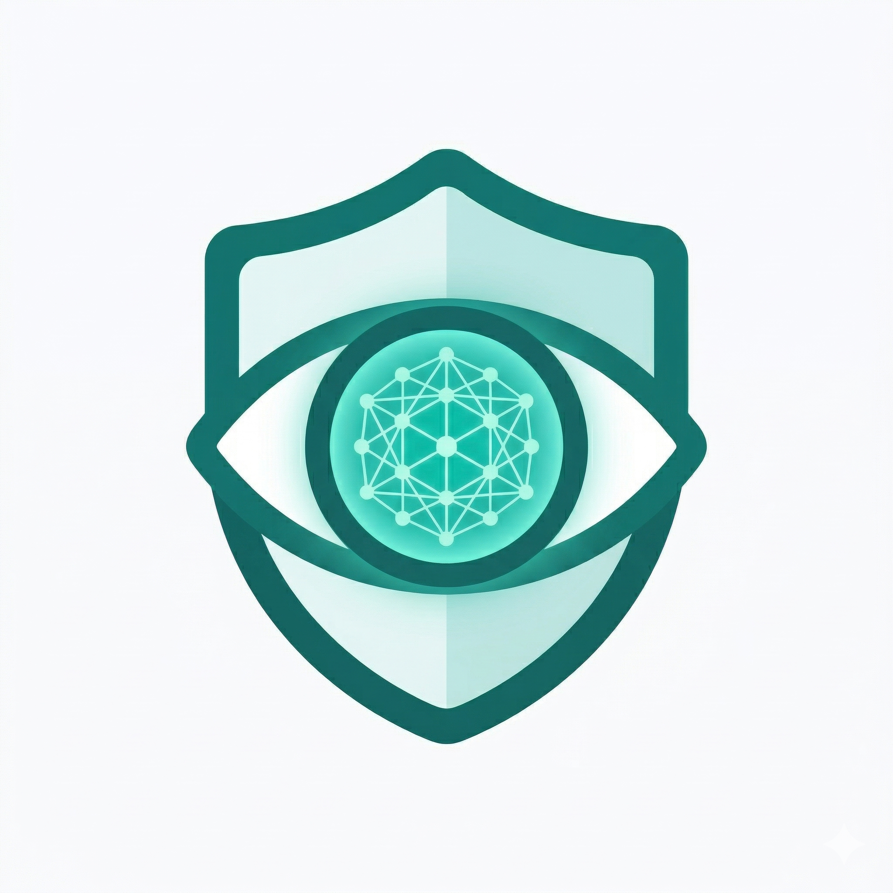
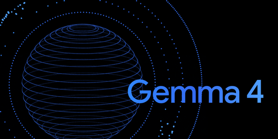

# Gemma Guard

<p align="center">
      
</p>
<p align="center">    
❤️
</p>
<p align="center">    
  
</p>

<p align="center">
  <strong>On-device phishing detection powered by Gemma 4.</strong><br/>
  No cloud. No data upload. No compromises.
</p>

<p align="center">
  Built for the <a href="https://www.kaggle.com/competitions/gemma-4-good-hackathon">Gemma 4 Good Hackathon</a>
</p>

---

**Phishing works because it looks real. Gemma Guard catches it before you act — one tap, fully offline, across every app on your phone.**

---

## Why We Built This

Milana's mother is almost 70. Last year she was scammed by a phishing message on her phone. She did everything right by her instincts — she read it carefully, it looked legitimate — and she still got caught.

When we looked for tools that could have helped her, we found the same problem everywhere: they require a browser extension, a cloud account, or a level of digital fluency that puts them out of reach for the people who need them most.

So we built Gemma Guard for her specifically. The floating trigger button exists because taking a screenshot on a modern Android phone is genuinely non-obvious if you didn't grow up with one. One tap on a visible button is something anyone can do. The share button exists because after she runs an analysis, she wants to show her family — and there is something meaningful about a 70-year-old proudly sending a scan result to her kids to say she checked before she clicked.

That is the user this app is designed for. Everyone else is a bonus.

## Demo

> Screenshots and demo video coming before final submission.

| Floating trigger | Scanning | Verdict |
|:---:|:---:|:---:|
| *(screenshot)* | *(screenshot)* | *(screenshot)* |

---

## The Problem

Phishing is the #1 social engineering attack worldwide. It is fast, convincing, and disproportionately effective against the users who are least equipped to recognize it. Most defenses require a cloud connection, send your screen data to a remote server, or only work inside a single browser — leaving the majority of attack surface unprotected.

## What Gemma Guard Does

A floating trigger button sits over any app. Tap it and three things happen:

1. **Capture** — MediaProjection takes a full screenshot of the current screen
2. **Extract** — ML Kit reads the screenshot on-device and extracts all visible text via OCR
3. **Analyze** — both the screenshot *and* the OCR text are sent to Gemma 4 running locally via LiteRT-LM

The result is a clear, explainable verdict: risk level, confidence score, the specific reasons behind the assessment, and a recommended action — all generated locally, in seconds, without touching the internet.

## Why Gemma 4

Most phishing detection reads text. Gemma 4 reads the whole picture — literally.

Attackers don't just write convincing words. They use fake logos, spoofed brand layouts, and visual urgency cues that no amount of text parsing will catch. Sending the raw OCR output to a text model misses all of that. Sending only the screenshot misses subtle linguistic manipulation.

Gemma Guard feeds **both** to Gemma 4 simultaneously. The model sees the visual layout *and* reads the extracted text in a single multimodal pass — catching the brand impersonation in the logo while also flagging the credential-harvesting sentence below it.

Running this through LiteRT-LM means the inference happens entirely on-device. No screenshot ever leaves the phone. No API key. No cloud dependency. Gemma 4 is the model that makes this specific combination possible: multimodal reasoning over image and text, at a size that runs on consumer Android hardware via LiteRT.

## Example Output

Given a screenshot of a fake PayPal message saying *"Your account has been locked. Verify your password immediately at paypa1-secure.link"*:

```
Risk Level:    HIGH
Confidence:    87%

Reasons:
  • Uses urgent or high-pressure language.
  • Mentions credentials, account access, or verification details.
  • Uses brand or account language that could be impersonation.
  • The detected link or domain has suspicious formatting.

Recommendation:
  Do not reply or pay. Verify the request through the official
  app or a trusted contact.
```

## Why It Matters

|  | Gemma Guard | Cloud-based tools |
|--|-------------|-------------------|
| Works offline | ✅ | ❌ |
| No data leaves the device | ✅ | ❌ |
| Works across every app | ✅ | ❌ (browser-only) |
| No subscription | ✅ | Often ❌ |
| Explainable verdict | ✅ | Rarely |

This makes Gemma Guard meaningful for users in low-connectivity environments, users in regions where cloud services are unavailable or untrusted, and anyone who has ever received a suspicious message outside a browser — which is everyone.

Two design decisions reflect this directly. The floating trigger button replaces the non-intuitive screenshot gesture with a single tap that works from any app. The share button lets users send their analysis result to family or friends — turning a security check into something you can be proud of, not just relieved by.

## Fallback Analyzer

When Gemma 4 is initializing or unavailable, the app routes automatically to a lightweight on-device rule-based analyzer. It is not a placeholder — it checks for concrete, high-signal phishing patterns:

- **Urgency and pressure language** — "urgent", "act now", "final warning", "account suspended"
- **Payment and money requests** — PayPal, Venmo, Zelle, gift cards, crypto, wire transfers
- **Credential harvesting** — password, OTP, verification code, login, bank account, SSN
- **Suspicious links and domains** — digits in the domain, multiple hyphens, high-risk TLDs (`.xyz`, `.top`, `.ru`, `.cn`)
- **Brand impersonation** — known brand names (Apple, Google, Amazon, Chase) combined with links or credential requests

Each matched signal contributes to a scored result with the same structured output format as the Gemma 4 path. The model is always the primary path; the fallback is the safety net.

## Localized Analysis

Gemma Guard detects the device language at runtime and loads matching prompt files from `app/src/main/assets/prompts/`. If no localized prompt exists for the device language, it falls back to the default English prompt — no configuration required.

Currently supported languages:

| Language | Code | Prompt path |
|----------|------|-------------|
| English (default) | — | `prompts/` |
| Russian | `ru` | `prompts/ru/` |

The Russian prompt instructs Gemma 4 to produce its reasoning, risk assessment, and recommendation in Russian — while preserving any quoted fragments from the suspicious screen in their original language. This matters: the model must not translate attacker-controlled text, only explain it.

This means a 70-year-old user in Russia sees the verdict in her own language, on her own device, with no data leaving the phone. The threat detection works the same. The explanation is just legible.

Adding a new language requires two files — `prompts/<code>/system_prompt.txt` and `prompts/<code>/user_prompt.txt` — and no code changes.

## Technical Stack

| Component | Role |
|-----------|------|
| [Gemma 4 (E2B)](https://ai.google.dev/gemma) | Multimodal LLM — phishing analysis from image + text |
| [LiteRT-LM](https://ai.google.dev/edge/litert) | On-device inference via Google AI Edge |
| [ML Kit Text Recognition](https://developers.google.com/ml-kit/vision/text-recognition) | On-device OCR |
| [MediaProjection](https://developer.android.com/media/grow/media-projection) | System-level screenshot capture |
| Kotlin + Material 3 | Android app, modern Views architecture |

The app is entirely local-first. There are no API calls, no telemetry, and no network permissions required for analysis.

## Hackathon Track Alignment

**Special Technology — LiteRT Prize**
Gemma Guard is built on LiteRT-LM end-to-end. On-device inference is not a feature — it is the architecture. The app would not exist without LiteRT.

**Special Technology — Cactus Prize**
The app implements intelligent local task routing: Gemma 4 is the primary analysis engine; a lightweight on-device signal analyzer handles fallback when the model is unavailable. Both paths run entirely on the device.

**Impact — Safety & Trust**
Every verdict includes the specific reasons Gemma 4 flagged the content and a concrete recommendation. The model does not return a score — it explains itself. Transparency is built into the product flow, not added on top.

**Impact — Digital Equity & Inclusivity**
Phishing protection that requires a cloud connection is protection that fails the users who need it most. Gemma Guard works offline, requires no account, and runs on consumer-grade Android hardware — making advanced threat detection accessible regardless of connectivity or income.

The app also adapts its analysis language to the device locale. A Russian-speaking user sees the verdict, reasons, and recommendation in Russian — fully on-device, with no translation service involved. Adding further language support requires only two prompt files and no code changes.

## Getting Started

See [SETUP.md](SETUP.md) for the full setup guide including how to stage the Gemma 4 model file onto your device.

**Quick start:**

```bash
# Stage the model onto the device
adb shell mkdir -p /data/local/tmp/llm
adb push gemma-4-E2B-it.litertlm /data/local/tmp/llm/gemma-4-E2B-it.litertlm
```

Then open the project in Android Studio, run on a physical Android device, and grant the screen capture and overlay permissions on first launch.

## Project Layout

```
app/                    Android application module
├── capture/            MediaProjection screen capture + overlay trigger
├── ocr/                ML Kit OCR engine
├── analysis/           Gemma 4 analyzer, fallback analyzer, prompt builder
├── inference/          LiteRT-LM model manager and locator
└── ui/                 MainActivity, Material 3 views
SETUP.md                Model staging and device setup guide
```

## Team

**Milana and Pavel**

| Name | Email |
|------|-------|
| Milana Kerbel | milana159@gmail.com |
| Pavel Kerbel | kerbelp@gmail.com |

## License

[Creative Commons Attribution 4.0 International (CC BY 4.0)](LICENSE)

Copyright © 2025 Milana Kerbel, Pavel Kerbel
